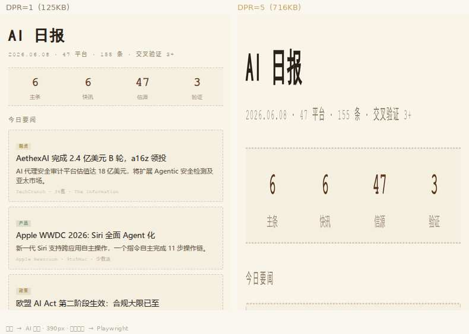

# Playwright Screenshot — High-DPI HTML → PNG

> `npx skills add veryos/playwright-screenshot`

Replace wkhtmltoimage with Playwright at **deviceScaleFactor=5** for crystal-clear Chinese text. Born from real-world testing — DPR=5 renders at 1950px then scales down for 4× oversampling.



*Left: DPR=1 (125KB, wkhtmltoimage level). Right: DPR=5 (716KB, 4× oversampling). Same HTML, same 390px width, same Microsoft YaHei font.*

## Quick Start

```bash
npx skills add veryos/playwright-screenshot
pip install playwright pillow
python -m playwright install chromium
```

## Usage

```python
from playwright.sync_api import sync_playwright
from PIL import Image

with sync_playwright() as p:
    browser = p.chromium.launch()
    ctx = browser.new_context(device_scale_factor=5, viewport={"width": 390, "height": 960})
    page = ctx.new_page()
    page.goto("file://output.html")
    page.screenshot(path="output.png", full_page=True)
    ctx.close()
    browser.close()

img = Image.open("output.png")
img = img.resize((390, int(img.height * 390 / img.width)), Image.LANCZOS)
img.save("output.png", quality=95)
```

## DPR Selection Guide

| DPR | Render width (390px card) | File size | Use case |
|-----|--------------------------|-----------|----------|
| 1 | 390px | ~125KB | Debug only |
| 2 | 780px | ~270KB | Quick preview |
| 3 | 1170px | ~420KB | Daily use |
| **5** | **1950px** | **~700KB** | **Production (default)** |

## Migration from wkhtmltoimage

| wkhtmltoimage (deprecated) | Playwright (this skill) |
|---|---|
| `--width 390 --quality 95` | `viewport={"width": 390}` + `quality=95` |
| QtWebKit engine | Chromium Skia |
| ❌ No DPR support | ✅ `device_scale_factor=5` |

## Fonts for Chinese

```css
body { font-family: 'Microsoft YaHei', 'PingFang SC', sans-serif; }
h1   { font-family: 'SimHei', sans-serif; }
```

Sans-serif fonts outperform serif fonts at small sizes on low-DPI displays.

## License

MIT
