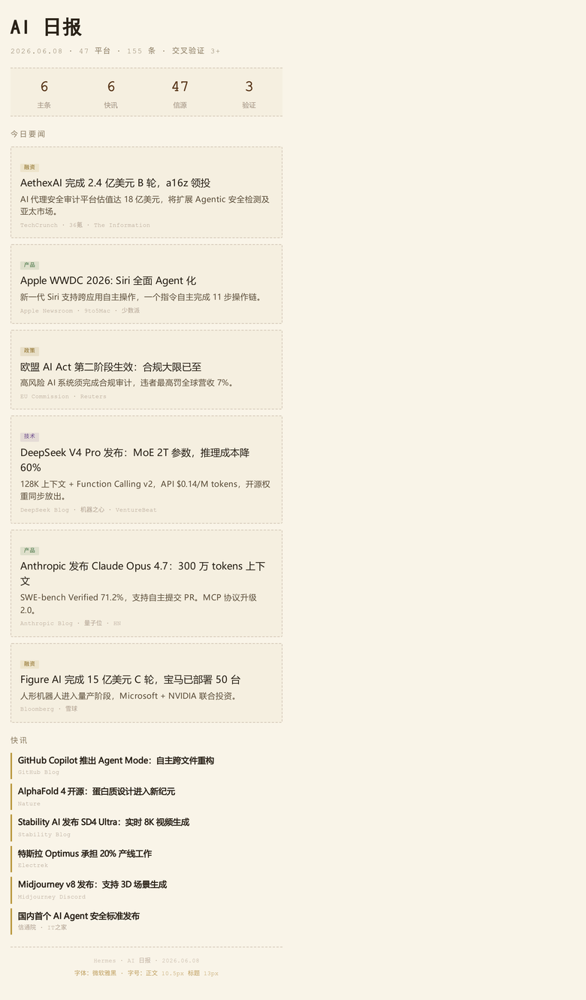

# Playwright Screenshot — 高 DPI HTML 截图

> `npx skills add veryos/playwright-screenshot`

用 Playwright **DPR=5** 替代 wkhtmltoimage。

<table><tr>
<td width="50%"><b>DPR=1</b> · 122KB</td>
<td width="50%"><b>DPR=5</b> · 212KB · 4 倍超采样</td>
</tr><tr>
<td></td>
<td></td>
</tr></table>

390px 移动端卡片，DPR=5 以 1950px 渲染后缩放，字体锐利。

## License

MIT
